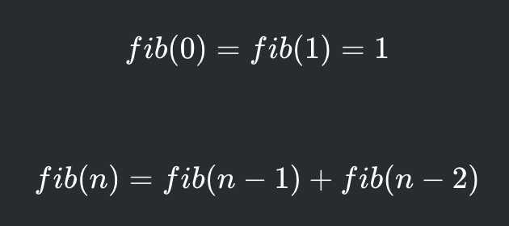

# Fibonacci

A famous mathematical sequence is the Fibonacci sequence. This sequence is defined as follows:

Write a program that, given *N*, returns the *n*th Fibonacci number.

## Input

The input contains a single integer *N*.

## Output

The value of the *n*th Fibonacci number.

## Constraints

- 0 <= *N* <= 30
